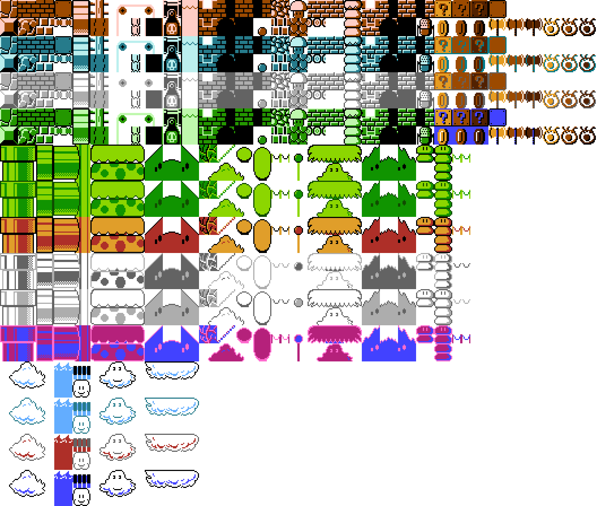

# Resources

## Config

## map

### Tile

**col**: The column within the game map the tile corresponds to

**row**: The row within the game map the tile corresponds to

**sprite**: The *initial* sprite value associated with the tile. (This will be changed once block animations are introduced).

**state**: The state of the block (currently only `SOLID`, or `AIR`).

**type**: The type of the block (i.e. `BRICK`, `PIPE`, etc..). A full list can be found at here (TODO: make here a link).

### Background

### Foreground

## Sprites

Spritesheet: 

## List of Tile Types

BRICK:

?:

PIPE:

PIPETOP:

CLOUD:

BUSH:

SKY: 

